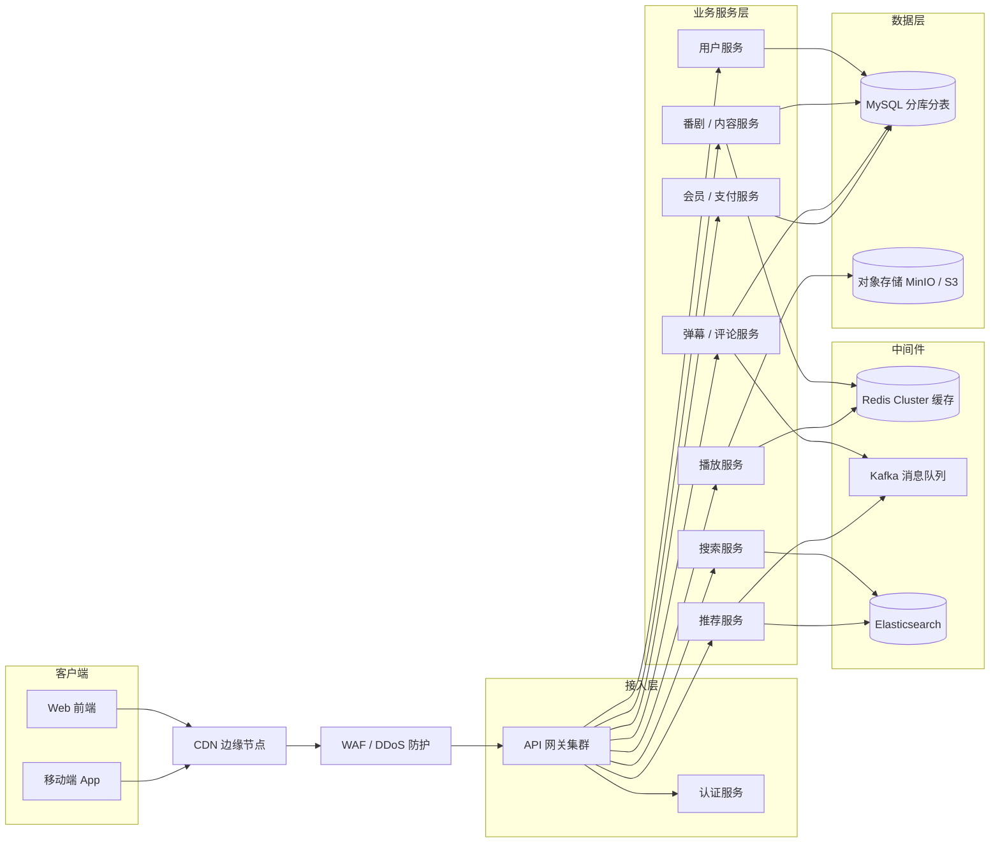
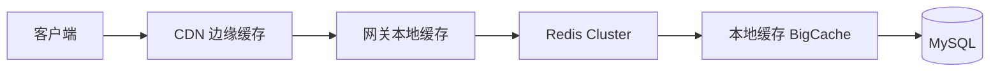
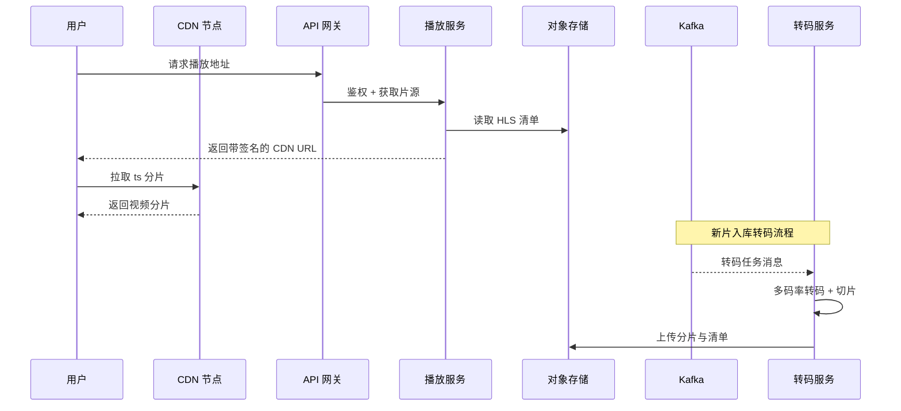

# WindLiberity 后端高性能架构设计文档

> 版本：v0.1（草案）
> 适用项目：WindLiberity —— 动漫视频流媒体应用
> 文档性质：架构设计 / 技术选型 / 高性能与高可用方案

---

## 1. 背景与业务场景

WindLiberity 是一款以动漫视频为主的流媒体应用，核心业务包括：

- 番剧内容浏览（首页、详情、剧集列表）
- 视频在线播放（多码率、断点续播、选集）
- 搜索与推荐
- 弹幕与评论
- 用户体系（登录注册）
- 会员 / 付费内容（后续扩展）

业务特征：

- **读多写少**：视频观看、浏览、搜索远多于写入。
- **流量集中于视频分发**：带宽与 CDN 成本是主要瓶颈。
- **热点集中**：新番首播、热门番剧会形成瞬时热点。
- **交互实时性要求高**：弹幕、播放进度上报要求低延迟高吞吐。

---

## 2. 设计目标与性能指标

| 类别 | 目标值 |
| --- | --- |
| 核心读接口（首页 / 详情 / 播放地址） | P99 < 100ms（服务端，不含网络） |
| 视频首帧时间 | TTFB < 300ms（CDN 命中场景） |
| 弹幕 / 评论写接口 | P99 < 200ms |
| 系统可用性 | 99.95%（月度不可用 ≤ 21.6 分钟） |
| 峰值读 QPS | 10 万+（可水平扩展） |
| 峰值写 QPS | 2 万+（可水平扩展） |
| 视频分发带宽 | 依赖 CDN 承载，源站回源率 < 5% |
| 数据可靠性 | RPO ≤ 1min，RTO ≤ 30min（核心库） |

---

## 3. 总体架构

---

## 4. 技术选型

| 层次 | 技术 | 选型理由 |
| --- | --- | --- |
| 开发语言 | Go（首选）/ Node.js 备选 | 高并发、低内存、部署简单、生态成熟 |
| 服务框架 | Go：Kratos / Gin / FastHTTP | 性能与工程化平衡 |
| API 网关 | APISIX / Envoy + Istio | 高性能、插件化，支持限流 / 鉴权 / 熔断 |
| 关系型数据库 | MySQL 8.0（分库分表 + 读写分离） | 成熟稳定，社区与运维工具丰富 |
| 缓存 | Redis Cluster + 本地缓存（BigCache） | 多级缓存，热点数据低延迟 |
| 搜索引擎 | Elasticsearch / OpenSearch | 全文检索 + 聚合推荐 |
| 消息队列 | Kafka | 高吞吐、持久化、削峰填谷 |
| 对象存储 | MinIO（自建）/ S3 / 阿里云 OSS | 存视频分片、封面、静态资源 |
| CDN | Cloudflare / 云厂商 CDN | 视频分片边缘缓存，降低源站带宽 |
| 转码 | FFmpeg + 分布式 Worker | 多码率转码、切片（HLS） |
| 可观测性 | OpenTelemetry + Prometheus + Grafana + Loki + Jaeger | 指标 / 日志 / 链路追踪统一 |
| 容器编排 | Kubernetes + Helm + ArgoCD | 自动扩缩容、GitOps 发布 |
---

## 5. 核心模块设计

### 5.1 接入层

- **CDN**：负责视频 `ts` 分片、图片、静态资源的边缘缓存，回源率目标 < 5%。
- **WAF**：防 SQL 注入、XSS、CC / DDoS 攻击。
- **API 网关**：
  - 统一鉴权、路由、限流、熔断、灰度路由、请求日志。
  - 协议：REST + gRPC（内部服务间用 gRPC 降低开销）。

### 5.2 业务服务层（微服务拆分）

| 服务 | 职责 |
| --- | --- |
| 用户服务 | 注册、登录、资料、关注 |
| 内容服务 | 番剧、剧集、元数据、首页聚合 |
| 播放服务 | 播放地址签发、片源选择、播放进度 |
| 搜索服务 | 番剧 / 标签全文搜索 |
| 弹幕 / 评论服务 | 弹幕写入与读取、评论 |
| 推荐服务 | 热门榜、个性化推荐 |
| 会员 / 支付服务 | 会员权益、付费内容（预留） |

原则：**无状态设计**，所有状态外置到 Redis / MySQL / Kafka，便于水平扩展。

### 5.3 数据层

- MySQL 按业务垂直拆分 + 按主键水平分库分表。
- 读写分离：主库写入，从库读；通过数据库中间件或应用层路由。
- 冷热数据分离：历史播放记录、旧弹幕归档到对象存储或归档表。

---

## 6. 高性能设计要点

### 6.1 多级缓存

常见问题与对策：

| 问题 | 对策 |
| --- | --- |
| 缓存穿透 | 布隆过滤器 + 空值缓存 |
| 缓存击穿 | 热点 Key 互斥锁 / 逻辑过期 |
| 缓存雪崩 | TTL 随机化、多级缓存、限流降级 |
| 缓存一致性 | Cache Aside + 延迟双删 / 订阅 binlog（Canal）更新 |

### 6.2 视频流优化

- **转码流水线**：上传原片 → 转码多码率（1080p / 720p / 480p）→ 切片 → 上传对象存储。
- **HLS / DASH**：按 4~6 秒切片，客户端按码率自适应切换。
- **签名 URL**：播放地址带时效签名，防止盗链。
- **CDN 预热**：新番上线前主动预热热门分片。
- **断点续播**：按分片序号记录播放进度。

### 6.3 异步化与削峰填谷

使用 Kafka 解耦以下场景：

| 场景 | 处理方式 |
| --- | --- |
| 弹幕 / 评论写入 | 先入 Kafka，异步落库，前端先展示（最终一致） |
| 播放埋点 / 行为日志 | Kafka → 数仓，不影响主链路 |
| 视频转码任务 | Kafka → 转码 Worker 集群 |
| 推荐事件 / 特征 | Kafka → 特征工程 → 推荐模型 |

### 6.4 数据库优化

- 合理索引、覆盖索引，治理慢查询（慢日志 + 执行计划）。
- 分库分表：按 `user_id` / `anime_id` 哈希分片，分片数提前规划为 2 的幂。
- 读写分离 + 从库延迟监控。
- 连接池（如 `sqlx` / `HikariCP`）合理配置，避免连接风暴。
- 大字段拆分，减少行宽，提升缓存命中率。

### 6.5 接口与协议优化

- 内部服务间使用 gRPC（HTTP/2 + Protobuf）。
- 响应体开启 gzip / br 压缩。
- 列表接口分页，避免一次返回大量数据。
- 首页聚合接口并发拉取子服务，设超时兜底（部分失败降级）。

---

## 7. 高可用与稳定性

### 7.1 容错机制

| 机制 | 说明 |
| --- | --- |
| 限流 | 网关层令牌桶 / 滑动窗口，服务层 Sentinel 类限流 |
| 熔断 | 下游失败率达到阈值自动熔断，快速失败 |
| 降级 | 推荐挂了显示热门榜，弹幕挂了仍可播放 |
| 超时控制 | 全链路超时（连接 / 读写 / 整体超时） |
| 重试与幂等 | 指数退避重试 + 唯一业务号保证幂等 |

### 7.2 高可用部署

- 所有服务至少 2 副本，跨可用区部署。
- 数据库主从 + 自动故障切换（MHA / Orchestrator）。
- Redis Cluster 多副本，Kafka 多副本。
- 多可用区 / 异地容灾，核心数据跨区备份。

### 7.3 发布策略

- 蓝绿发布 / 金丝雀发布，逐步放量。
- 健康检查 + 自动回滚。
- 配置中心统一管理，动态下发，无需重启。

---

## 8. 可观测性

| 维度 | 工具 | 关键指标 |
| --- | --- | --- |
| 日志 | Loki + 结构化日志 | 错误率、关键业务日志 |
| 指标 | Prometheus + Grafana | QPS、P99 延迟、错误率、缓存命中率 |
| 链路追踪 | OpenTelemetry + Jaeger | 慢调用定位、依赖拓扑 |
| 告警 | Alertmanager | 错误率 > 1%、P99 超阈值、资源水位 |

---

## 9. 安全设计

- **认证**：JWT + Refresh Token（或 OAuth2），网关统一校验。
- **传输安全**：全站 HTTPS / TLS 1.3。
- **视频防盗链**：签名 URL（时效 + Referer 校验），付费内容可用 DRM。
- **攻击防护**：WAF + 限流 + 风控（登录、评论、弹幕）。
- **数据安全**：密码加盐哈希（bcrypt / argon2），敏感字段加密存储。

---

## 10. 部署与运维

- **容器化**：所有服务打包为容器镜像，多阶段构建减小体积。
- **编排**：Kubernetes + HPA 根据 CPU / QPS 自动扩缩容。
- **IaC**：Terraform 管理云资源，Helm 管理应用。
- **CI/CD**：GitOps（ArgoCD），提交即构建、测试、灰度发布。
- **配置与密钥**：配置中心 + 密钥管理（Vault / KMS）。

---

## 11. 容量规划与性能测试

- **压测工具**：k6 / JMeter / wrk。
- **压测场景**：首页、详情、搜索、播放地址、弹幕读写。
- **容量模型**：以 QPS、P99 延迟、CPU / 内存 / 带宽为观测指标。
- **扩缩容阈值**：
  - CPU 持续 > 70% 或 P99 延迟超阈值 → 扩容。
  - 流量达到当前容量 80% → 提前扩容。

---

## 12. 关键决策对比

| 决策点 | 方案 A | 方案 B | 建议 |
| --- | --- | --- | --- |
| 服务语言 | Go | Node.js | Go（高并发核心服务） |
| 消息队列 | Kafka | RabbitMQ | Kafka（高吞吐、持久化） |
| 数据库 | MySQL 分库分表 | TiDB | 先 MySQL，数据量大再迁 TiDB |
| 对象存储 | 自建 MinIO | 云 OSS | 起步用 MinIO，量大用云 OSS |
| 视频协议 | HLS | DASH | HLS（兼容性最好） |

---

## 13. 演进路线图

1. **第一阶段（MVP）**：单体后端 + MySQL + Redis + 对象存储 + CDN，先跑通业务。
2. **第二阶段（拆服务）**：按 5.2 拆分为微服务，引入网关与 Kafka。
3. **第三阶段（高可用）**：多副本、多可用区、限流熔断、全链路可观测。
4. **第四阶段（规模化）**：分库分表、转码集群、推荐系统、异地容灾。

---

## 14. 附录：性能指标口径

- **QPS**：每秒请求数。
- **P95 / P99**：延迟分位数，P99 表示 99% 请求低于该值。
- **TTFB**：首字节时间，用户发出请求到收到第一个字节的时间。
- **回源率**：CDN 未命中、回源站拉取请求占比。
- **RPO / RTO**：灾难发生后可容忍的数据丢失时长 / 恢复时长。
